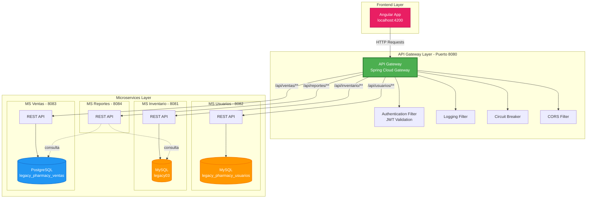
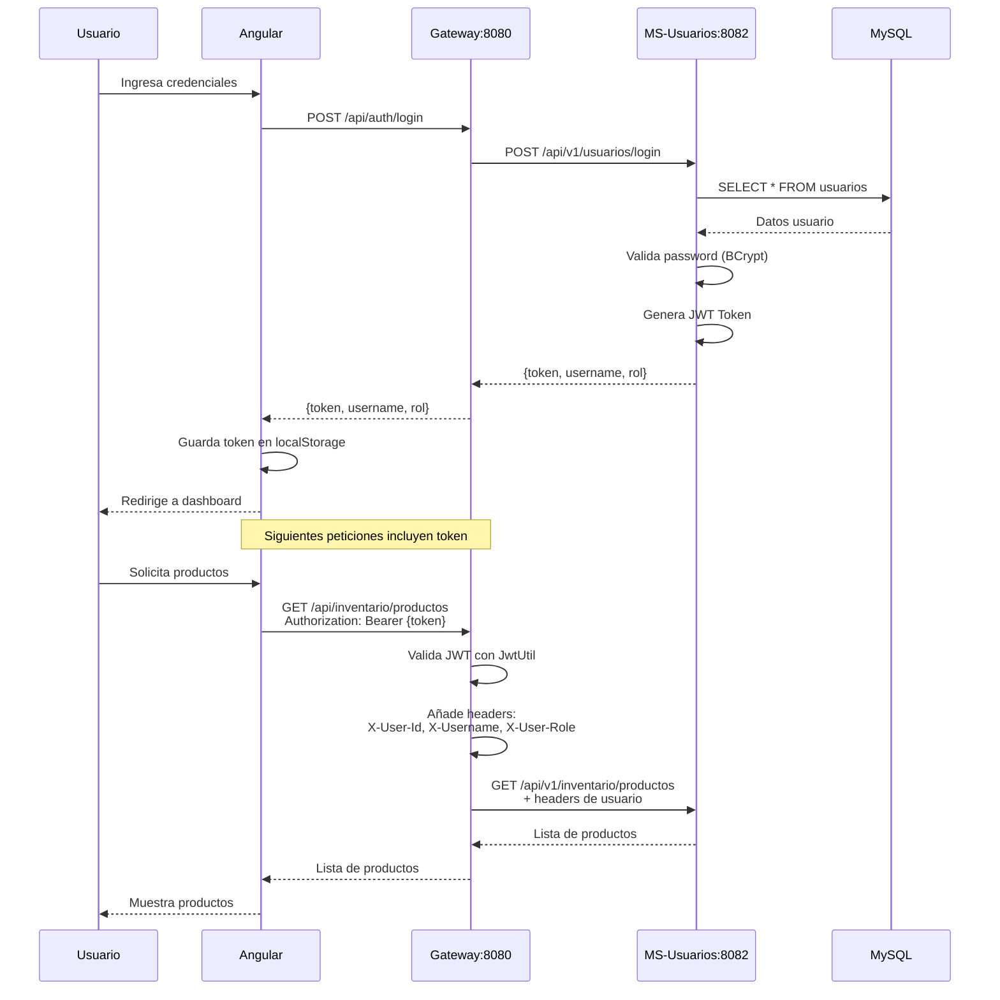
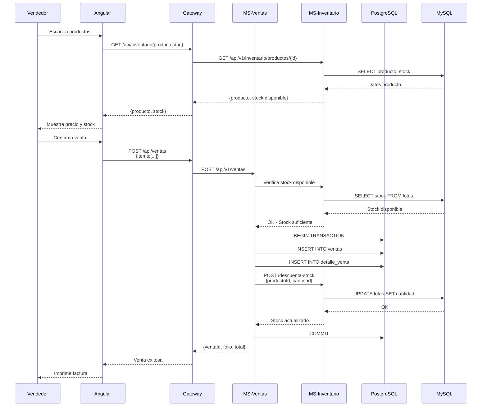
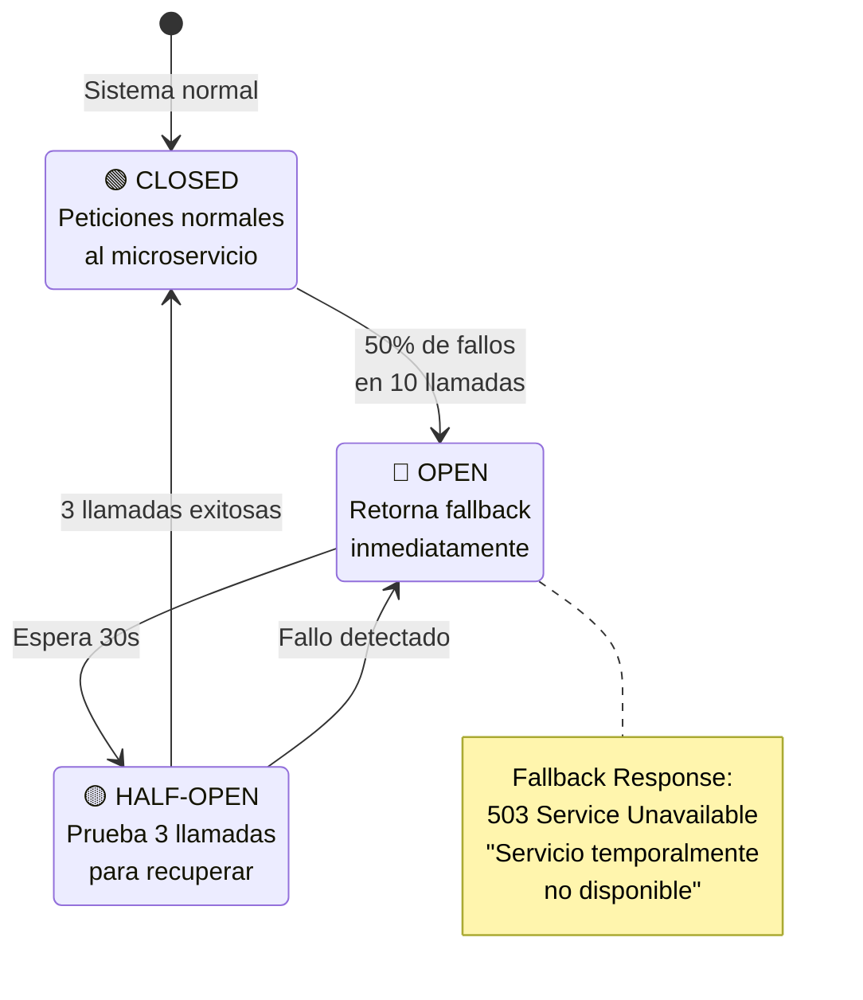
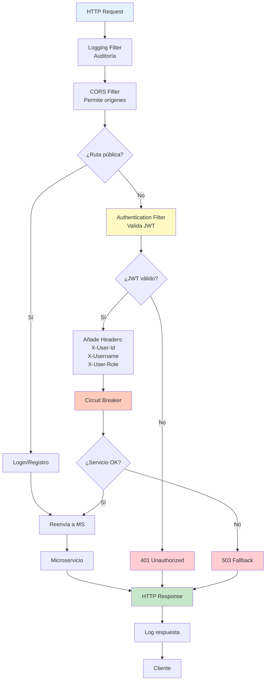

# Diagrama de Arquitectura - Legacy Pharmacy

## Arquitectura General del Sistema



## Flujo de Autenticación



## Flujo de Venta



## Rutas del Gateway

```mermaid
graph LR
    subgraph "Rutas Públicas"
        LOGIN[/api/auth/login]
        REGISTRO[/api/auth/registro]
    end

    subgraph "Rutas Protegidas"
        subgraph "Usuarios"
            U1[/api/usuarios/**]
        end
        
        subgraph "Inventario"
            I1[/api/inventario/productos/**]
            I2[/api/inventario/lotes/**]
            I3[/api/inventario/categorias/**]
            I4[/api/inventario/entrada]
        end
        
        subgraph "Ventas"
            V1[/api/ventas/**]
            V2[/api/facturas/**]
        end
        
        subgraph "Reportes"
            R1[/api/reportes/ventas/**]
            R2[/api/reportes/inventario/**]
            R3[/api/reportes/financieros/**]
        end
    end

    Gateway{Gateway<br/>:8080}
    
    LOGIN --> Gateway
    REGISTRO --> Gateway
    U1 --> Gateway
    I1 --> Gateway
    I2 --> Gateway
    I3 --> Gateway
    I4 --> Gateway
    V1 --> Gateway
    V2 --> Gateway
    R1 --> Gateway
    R2 --> Gateway
    R3 --> Gateway

    Gateway -->|:8082| MS_Users[MS-Usuarios]
    Gateway -->|:8081| MS_Inv[MS-Inventario]
    Gateway -->|:8083| MS_Ventas[MS-Ventas]
    Gateway -->|:8084| MS_Report[MS-Reportes]

    style LOGIN fill:#81C784,stroke:#4CAF50
    style REGISTRO fill:#81C784,stroke:#4CAF50
    style U1 fill:#FFB74D,stroke:#FF9800
    style I1 fill:#FFB74D,stroke:#FF9800
    style V1 fill:#FFB74D,stroke:#FF9800
    style R1 fill:#FFB74D,stroke:#FF9800
    style Gateway fill:#E57373,stroke:#F44336,stroke-width:3px
```

## Circuit Breaker



## Componentes del Gateway



---

## Tecnologías por Capa

| Capa                | Tecnología               | Versión                  |
|---------------------|--------------------------|--------------------------|
| **Frontend**        | Angular                  | 17+                      |
| **Gateway**         | Spring Cloud Gateway     | 2023.0.0                 |
| **Autenticación**   | JWT (jjwt)               | 0.12.3                   |
| **Circuit Breaker** | Resilience4j             | Incluido en Spring Cloud |
| **MS-Usuarios**     | Spring Boot + MySQL      | 3.2.0                    |
| **MS-Inventario**   | Spring Boot + MySQL      | 3.2.0                    |
| **MS-Ventas**       | Spring Boot + PostgreSQL | 3.2.0                    |
| **MS-Reportes**     | Spring Boot              | 3.2.0                    |
